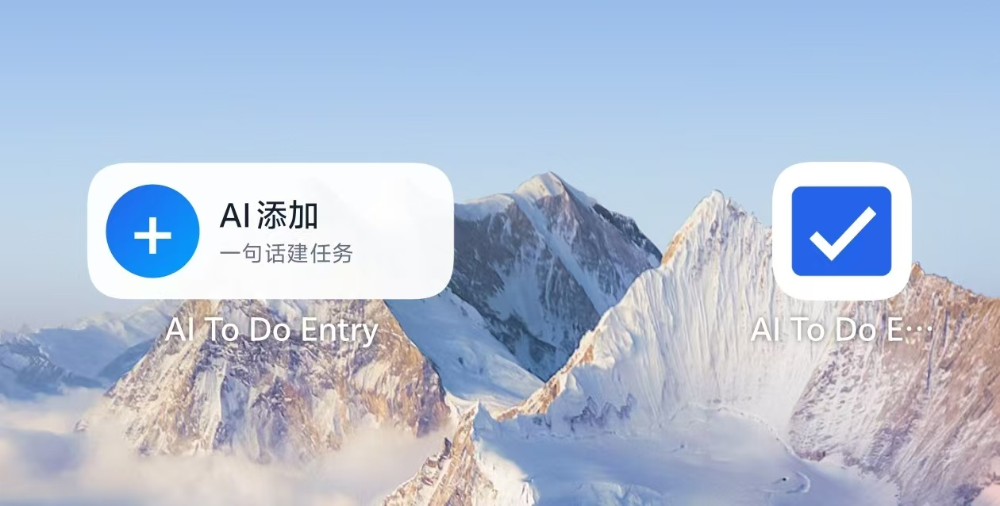
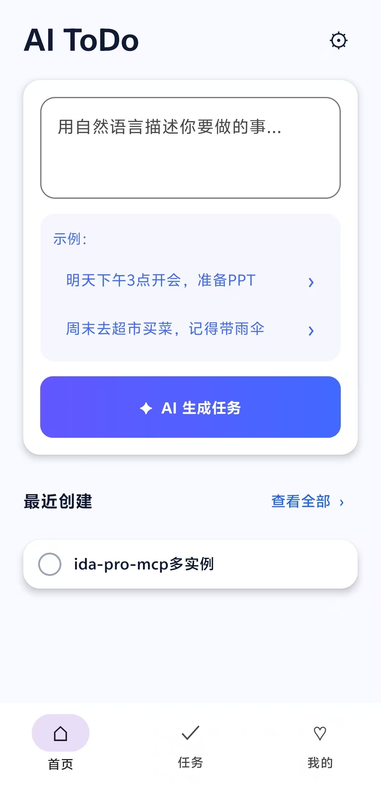
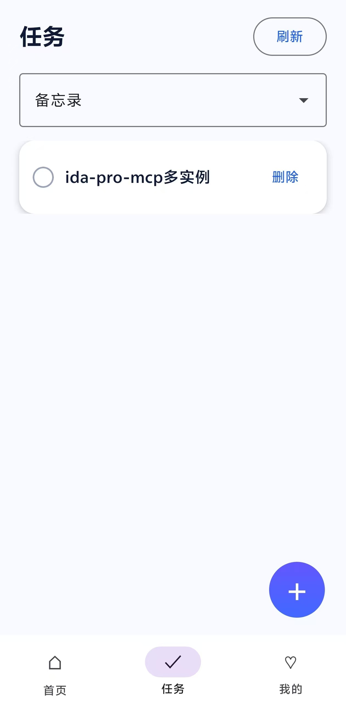
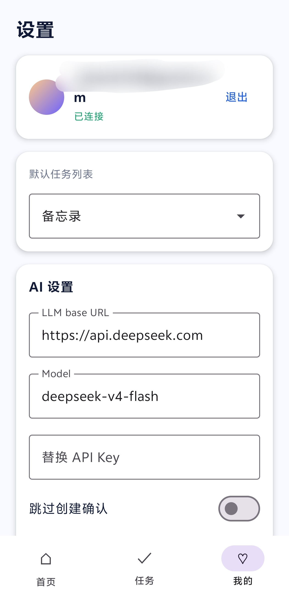

# AI To Do Entry

AI To Do Entry 是一个轻量级 Android 应用，用来补充 Microsoft To Do 缺少的 AI 快速建任务能力。用户用自然语言描述要做的事，应用调用 OpenAI-compatible 模型解析成结构化任务，确认后通过 Microsoft Graph 创建到 Microsoft To Do。

这个项目不是完整的 To Do 克隆。任务数据仍以 Microsoft To Do 为准，本应用只做 AI 入口、确认创建和轻量管理。

## 截图

| AI 小组件入口                                             | 首页 AI 输入                                           |
| --------------------------------------------------------- | ------------------------------------------------------ |
|  |  |

| 任务预览                                  | 我的与 AI 设置                                                    |
| ----------------------------------------- | ----------------------------------------------------------------- |
|  |  |

## 功能

- 自然语言生成 Microsoft To Do 任务。
- AI 解析后进入预览页，用户确认后再创建任务。
- 支持 OpenAI-compatible LLM 接口，例如 DeepSeek。
- 使用 MSAL Android 登录个人 Microsoft 账号。
- 通过 Microsoft Graph 管理 To Do：
  - 获取任务列表
  - 创建任务
  - 查看任务
  - 完成 / 重新打开任务
  - 删除任务
  - 编辑标题、备注、重要性、到期时间、提醒时间
- 2x1 桌面小组件，用于快速打开 AI 建任务入口。
- AI 设置页支持连通性测试。
- LLM API Key 使用本机加密存储。
- GitHub Actions 自动运行测试、lint 和 release 构建。

## 技术栈

- Kotlin
- Jetpack Compose
- Material 3
- Coroutines
- MSAL Android
- Microsoft Graph REST API
- OkHttp
- Moshi
- DataStore
- Jetpack Security Crypto

## 仓库结构

```text
.
├── app/
│   ├── build.gradle.kts                 # Android App 模块配置
│   ├── proguard-rules.pro               # Release 混淆保留规则
│   └── src/
│       ├── main/
│       │   ├── AndroidManifest.xml
│       │   ├── java/com/xiang/ai/todoentry/
│       │   │   ├── ai/                  # LLM 请求、Prompt 和解析
│       │   │   ├── auth/                # MSAL 登录和 token 获取
│       │   │   ├── graph/               # Microsoft Graph DTO 与客户端
│       │   │   ├── settings/            # DataStore 与加密 API Key 存储
│       │   │   ├── ui/                  # Compose 页面和 ViewModel
│       │   │   └── widget/              # 桌面小组件
│       │   └── res/
│       │       ├── raw/msal_config.json # MSAL public client 配置
│       │       └── xml/                 # Widget provider 配置
│       └── test/                        # 单元测试
├── docs/images/                         # README 截图
├── .github/workflows/android.yml        # GitHub Actions
├── gradle/                              # Gradle Wrapper
├── README.md
└── settings.gradle.kts
```

`sources/` 目录如果存在，只作为反编译参考，不属于本应用源码。

## 环境要求

- Android Studio
- JDK 17
- Android SDK，compile SDK 35
- Android 8.0 或更高版本的真机 / 模拟器
- 个人 Microsoft 账号
- Azure App Registration
- OpenAI-compatible LLM 服务和 API Key

## Microsoft 配置

应用使用 Microsoft Graph delegated 权限访问个人 Microsoft To Do。

需要的权限：

- `User.Read`
- `Tasks.ReadWrite`

当前包名：

```text
com.xiang.ai.todoentry
```

MSAL 配置文件：

```text
app/src/main/res/raw/msal_config.json
```

如果你要部署自己的版本，需要在 Azure Portal 创建 App Registration，并更新：

- `client_id`
- `redirect_uri`
- Azure Portal 中的 Android redirect URI

仓库里提交的 `client_id` 是 public client 标识，不是密钥。不要提交 client secret、签名证书、API Key 或任何密码。

## LLM 配置

打开应用后进入 `我的` / `AI 设置`。

需要填写：

- Base URL，例如 `https://api.deepseek.com`
- Model，例如 `deepseek-v4-flash`
- API Key

API Key 只保存在设备本地的加密存储中，不会提交到仓库，也不会写入日志。

## 构建

运行单元测试：

```bash
./gradlew testDebugUnitTest
```

运行 Android lint：

```bash
./gradlew lintDebug
```

构建 debug APK：

```bash
./gradlew assembleDebug
```

构建 release APK：

```bash
./gradlew assembleRelease
```

如果没有配置签名信息，默认产物是 unsigned release APK：

```text
app/build/outputs/apk/release/app-release-unsigned.apk
```

## Release 签名

本项目支持通过环境变量或本地 `keystore.properties` 注入 release 签名信息。

本地 signed release 构建需要提供：

```text
AI_TODO_KEYSTORE_FILE
AI_TODO_KEYSTORE_PASSWORD
AI_TODO_KEY_ALIAS
AI_TODO_KEY_PASSWORD
```

或在仓库根目录创建未提交的 `keystore.properties`：

```properties
storeFile=release-keystore.jks
storePassword=your_store_password
keyAlias=your_key_alias
keyPassword=your_key_password
```

不要把 `.jks`、密码或 keystore properties 提交到仓库。

## GitHub Actions

CI 配置文件：

```text
.github/workflows/android.yml
```

CI 会运行：

- `testDebugUnitTest`
- `lintDebug`
- `assembleRelease`

release APK 会作为 workflow artifact 上传。

如果希望 GitHub Actions 构建 signed release APK，需要在仓库 Secrets 中配置：

```text
AI_TODO_KEYSTORE_BASE64
AI_TODO_KEYSTORE_PASSWORD
AI_TODO_KEY_ALIAS
AI_TODO_KEY_PASSWORD
```

`AI_TODO_KEYSTORE_BASE64` 是 `.jks` 文件内容的 base64 编码。

## 隐私说明

- 用户输入的自然语言内容会发送到用户配置的 LLM 服务。
- 创建任务时，任务内容会发送到 Microsoft Graph。
- LLM API Key 只保存在本机加密存储中。
- 应用不会主动保存用户输入历史。
- 不要提交 API Key、签名证书、密码、Microsoft client secret 等敏感信息。

## 已忽略的本地文件

以下文件不会提交到仓库：

- `.idea/`
- `.gradle/`
- `local.properties`
- `keystore.properties`
- `*.jks`
- `*.keystore`
- 构建产物
- 本地设备 / 窗口调试抓取文件

## 许可证

暂未选择许可证。
